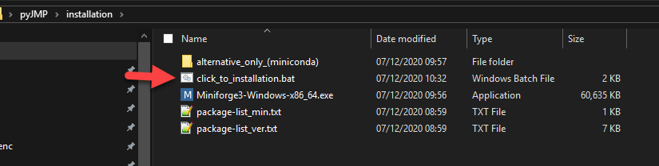
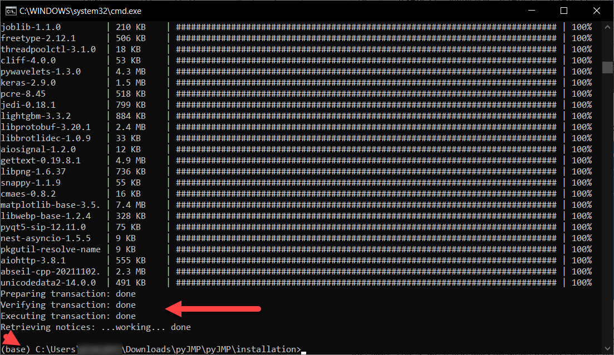
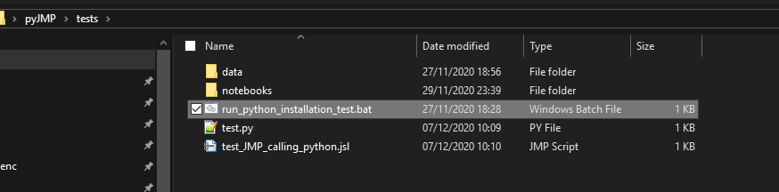
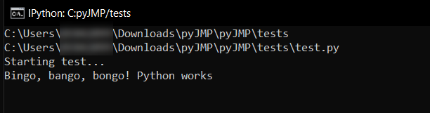
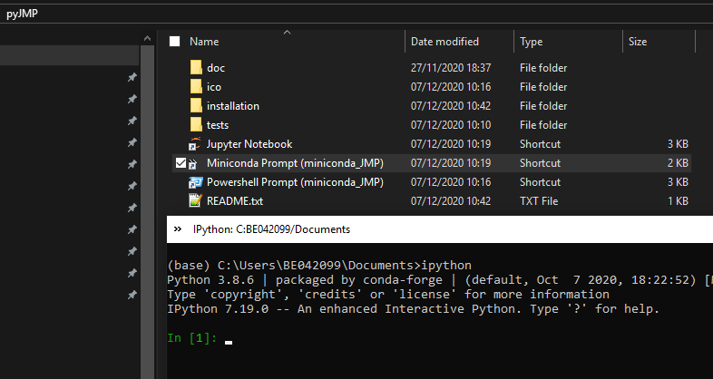
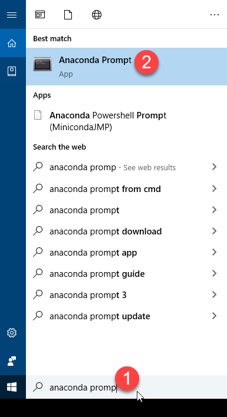
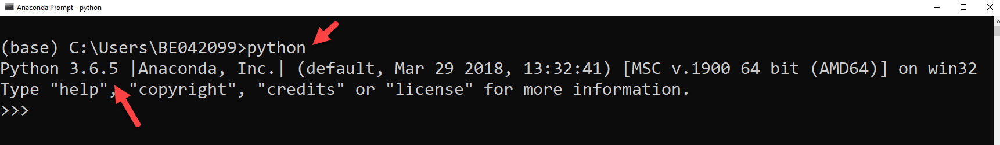
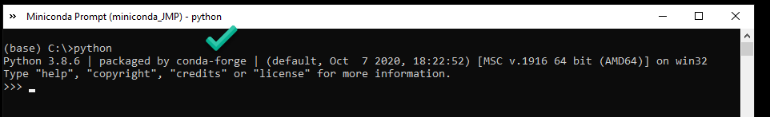

# pyJMP
An optional and independent Python environment that can be used with JMP (e.g. [Predictor Explainer](https://github.com/industrial-data/predictor-explainer)).

The following instructions don't require admin rights to install it.


## Installation steps (manual)

## 1 - Download and install the latest version of pyJMP

[Download](https://github.com/industrial-data/pyJMP/archive/refs/heads/main.zip)

Right click on the zip file, go to Properties and and mark the Unblock option if it is activated.

Unzip the pyJMP folder in your desktop and click the / **installation/click\_to\_install.bat** file which will install minforge but also all the required packages.



As you downloaded this file from your browser, a blue window may appear saying the following:


The .bat files simply automates the creation of folders and installation steps (you can open it with a notepad). Essentially, a folder called C:\ProgramData\Miniforge\_JMP will be created and used to install Miniforge ([URL](https://github.com/conda-forge/miniforge)). Your default Python, if any, will not be affected by this installation as it will be independent. If you want to install it manually in this folder, please check 'Just me' and deactivate any option that asks to use this installation as default (or path).

Miniforge ([URL](https://github.com/conda-forge/miniforge)) is used instead of Anaconda due to licensing, but they are equivalent. Your antivirus may not recognize miniforge, the file (check with your IT department).

A list of python packages (package-list\_min.txt) will be downloaded and installed. This is what you will see when the installation finishes:



If you have an error due to package conflicts, press enter or escape/enter to continue.

In case it does not work, use the following command to install the packages (in principle, this should not be needed).

```conda install -y **-c conda-forge** scikit-learn pandas numpy scipy matplotlib ipython jupyter numba dask datashader bokeh holoviews colorcet shap lightgbm umap-learn hdbscan optuna pynndescent```

There is a direct access to miniconda console in the main pyjmp folder (see second image below)

The list of packages can be found in ```package-list_min.txt``` with the total dependencies and their versions ```package-list_ver.txt```

Miniforge ([URL](https://github.com/conda-forge/miniforge)) is recommended over miniconda/Anaconda to avoid these mistakes. You can see the Annex for more information about his.```

## 2 - Test the installation

In your pyJMP folder go to ./tests and execute the run\_python\_installation.bat



If successful, you will see the following



Alternatively, you can also open a miniconda or jupyter notebook session.

These direct access icons are NOT needed for JMP to work, but may become handy if you want to modify the code deployed with JMP add-ins. You can place them wherever you want before deleting the pyJMP folder.



## 3 - New features and bugs

In case you found any error or bug installation or testing pyJMP, please submit a ticket.

## Annex: Anaconda is no longer free

Anaconda changed its license ([see FAQ](https://www.anaconda.com/blog/anaconda-commercial-edition-faq)), which means that users will require a commercial version. You can check the version opening "Anaconda or Miniconda Prompt (windows application) and enter Python.





This may require a commercial license. Miniconda prompt and conda-forge packages, should not require a commercial license.


